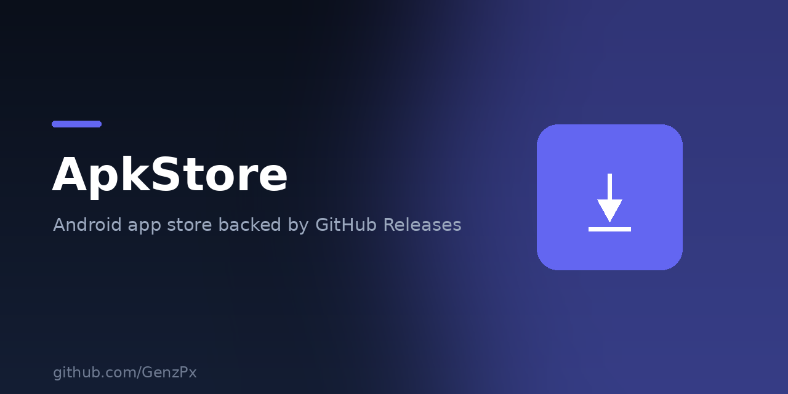

  

# APKstore

Mini Android app store. Users **login with GitHub**, upload an **APK**, and it becomes a **GitHub Release**. The public store lists every public repo tagged `netlify-apk-store`.

The APK never goes through Netlify (function body limit). The browser uploads straight to `uploads.github.com`.

## Stack

- Static UI (Vite) on Netlify
- Netlify Functions: OAuth start/callback + catalog search
- GitHub REST: repos, topics, releases, assets

## Deploy on Netlify

1. Push this folder to a GitHub repo.
2. [New GitHub OAuth App](https://github.com/settings/developers)
   - Homepage URL: `https://YOUR-SITE.netlify.app`
   - Authorization callback URL: `https://YOUR-SITE.netlify.app/api/oauth-callback`
3. Netlify → Add new site → this repo. Build: `npm run build`, publish: `dist`.
4. Site settings → Environment variables:
   - `GITHUB_CLIENT_ID`
   - `GITHUB_CLIENT_SECRET`
   - `GITHUB_TOKEN` (optional, a PAT with `public_repo` — only used by `/api/catalog` so guests are not rate-limited)
5. Redeploy.

Local preview is UI-only (`npm run dev`). OAuth needs the Netlify site.

## Publish flow

1. Login (`public_repo` + `read:user`).
2. Create or reuse `owner/<app-slug>`.
3. Set topics: `netlify-apk-store`, `android`, `apk`.
4. Write `apkstore.json` (name, description, package id).
5. Create release tag `vX.Y.Z` and upload the APK asset.

## Limits

- GitHub Release assets: 2 GB. Regular git files: 100 MB — that is why this uses Releases.
- Token is kept in `sessionStorage` so the browser can upload large files. Treat it like a logged-in session; logout clears it.
- Only **public** repos are indexed.

## License

MIT
